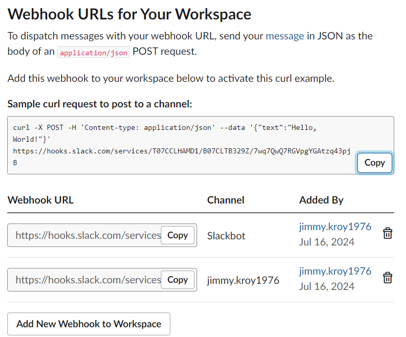
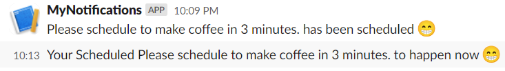
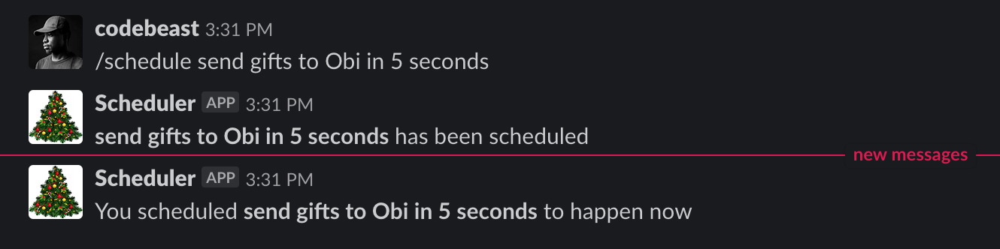

# Solution
I created ReminderScheduler App that uses a durable function. The ScheduleReminder endpoint can be called with the following Json format.
 
## The end point: [POST] /api/ScheduleReminder

```json
ScheduleReminder: [POST] /api/ScheduleReminder
{
    "text": "Please schedule to make coffee in 30 minutes." ,
    "timezone": "CEST",
    "iconEmoji": ":happy:"
}
``` 

## The end point: [POST] /api/DateTimeParser
I created a Node.js function called DateTimeParser that uses the chrono library to interpret the text and determine the timestamp of the event described in the passed text. The Rest Api can be called with the following Json format. 
```json
DateTimeParser: [POST] /api/DateTimeParser
{
    "text": "Please schedule to make coffee in 30 minutes." ,
    "timezone": "CEST",
}
``` 

The DateTimeParser Rest Api returns the following Json response. The returned timestamps is a Zulu timestamp (GMT+0), which needs to be converted to local time in the receiving function.
```json
{
    "text": "Please schedule to make coffee in 30 minutes.",
    "timestamp": "2024-07-19T13:14:08.613Z"
}
``` 

In order to send messages to Slack, you need to configure a webhook endpoint in your Slack account. To add a Slack webhook, follow these steps:

1. Navigate to the Slack API apps page: https://api.slack.com/apps/
2. Select the app where you want to activate the webhook.
3. Go to Features > Incoming Webhooks.
4. Enable Incoming Webhooks by clicking "Activate Incoming Webhooks".
5. Once activated, you can then add new webhooks to your chosen app.

```json
curl -X POST -H 'Content-type: application/json' --data '{"text":"Hello, World!"}' https://hooks.slack.com/services/<<Webhook Key>>
``` 

The resulting webhook can be seen in the following image. 





When running the ScheduleReminder you can see the messages appearing in the Slack view.





Note you can install js packages such as chrono by using the Kudo console at https://yourfunctionappname.scm.azurewebsites.net and navigate to the wwwroot folder and install the package that you need.

In the Kudo console, you navigate to D:\home\site\wwwroot. You can do so by using the command cd site\wwwroot and press enter on your keyboard. Once you’re in wwwroot, run the command npm i your-package to install the package. You can read more about this **[here](https://stackoverflow.com/questions/62971736/azure-functions-running-npm-install-on-azure-portal)**, **[here](https://sajeetharan.wordpress.com/2020/01/10/want-to-alert-your-employees-to-have-a-break-at-work-azure-function-can-help-you/)** and **[here](https://stackoverflow.com/questions/62971736/azure-functions-running-npm-install-on-azure-portal)**. 

## Resources/Tools Used

-   **[List of time zone abbreviations](https://en.wikipedia.org/wiki/List_of_time_zone_abbreviations)**
-   **[Chrono time zone abbreviations](https://github.com/wanasit/chrono/blob/344026e9a08f6956048691de3322f093a45daed5/src/common/refiners/ExtractTimezoneAbbrRefiner.ts)**
-   **[Use IHttpClientFactory ](https://learn.microsoft.com/en-us/dotnet/architecture/microservices/implement-resilient-applications/use-httpclientfactory-to-implement-resilient-http-requests)**

The local.settings.json looks like this:
```json
{
    "IsEncrypted": false,
  "Values": {
    "AzureWebJobsStorage": "UseDevelopmentStorage=true",
    "FUNCTIONS_WORKER_RUNTIME": "dotnet-isolated",
    "Slack:EndpointUrl": "https://hooks.slack.com/services/<< Webhook Key >>",
    "ChronoService:EndpointUrl": "https://gettimestamp.azurewebsites.net/api/DateTimeParser",
    "ChronoService:Key": "<< Azure Function Key >>"
  }
}
``` 

# Challenge 6: Durable Pattern


Happy St. Nicholas Day! Here in the Styrian region of Austria, it's said that today is the day that St. Nicholas goes around handing out presents, while his evil counterpart Krampus whips those who have been naughty. These days, that mostly results in people giving each other bundles of _ruten_, bundles of birch twigs that have been painted gold.

You're supposed to hang up these ruten year-round to remind children to be good, but of course today's children don't spend much more time in online chats than sitting in front of the fireplace. Let's write a reminder tool using serverless tech that lets Austrian children set reminders to do good deeds in their favorite chat app!

Build a chat integration for your favorite chat service (e.g. Discord or Slack) that lets you schedule tasks using natural language (e.g. `/schedule volunteer at the senior citizens' center tomorrow at 11:00`). You should be able to get a confirmation that your event has been scheduled, and then get a notification at the correct time.



## Resources/Tools Used 🚀

Here are some tools I recommend to help you complete this task:

| Tool                                                                                                                                                            | Description                                                  |
| --------------------------------------------------------------------------------------------------------------------------------------------------------------- | ------------------------------------------------------------ |
| [**Visual Studio Code**](https://code.visualstudio.com/?WT.mc_id=25daysofserverless-github-cxa)                                                                 | Code editor                                                  |
| [**Postman**](https://www.getpostman.com/downloads/)                                                                                                            | API testing client                                           |
| [**Azure Functions Extension**](https://marketplace.visualstudio.com/items?itemName=ms-azuretools.vscode-azurefunctions&WT.mc_id=25daysofserverless-github-cxa) | Scaffold, debug and deploy serverless functions from VS Code |
| [**Chrono**](https://github.com/wanasit/chrono)                                                                                                                 | Convert natural English language to date/time                |
| [**Moment Timezone**](https://github.com/moment/moment-timezone)                                                                                                | Handle timezones correctly from JS dates                     |

...and here are some resources to guide you:

| Resources                                                                                                                   | Description                                                     |
| --------------------------------------------------------------------------------------------------------------------------- | --------------------------------------------------------------- |
| [**Build a Slash Command**](https://api.slack.com/tutorials/slash-block-kit)                                                | Learn how to build a `/slash` command for Slack                 |
| [**Slack Incoming Webhooks**](https://api.slack.com/messaging/webhooks)                                                     | Learn what incoming message webhooks are and how to use them    |
| [**Stateful Serverless**](https://dev.to/azure/stateful-serverless-with-durable-functions-2jff)                             | Learn how to create schedules and timers with Durable Functions |
| [**Durable Contraints**](https://docs.microsoft.com/en-us/azure/azure-functions/durable/durable-functions-code-constraints) | Beware of non-deterministic functions                           |

## Getting Started 🔥

Follow this [dev.to tutorial](https://dev.to/azure/stateful-serverless-with-durable-functions-2jff) to learn how to get started with Durable functions.

## Next Steps 🏃

Learn more about serverless with a Free Training!

-   ✅ **[Serverless Free Courses](https://docs.microsoft.com/learn/browse/?term=azure%20functions&WT.mc_id=25daysofserverless-github-cxa)**

## Important Resources ⭐️

Here include all the important features related to the challenges that are integrated into microsoft.docs. Ex.:

-   ✅ **[Azure Functions documentation](https://docs.microsoft.com/azure/azure-functions/?WT.mc_id=25daysofserverless-github-cxa)**
-   ✅ **[Azure SDK for JavaScript Documentation](https://docs.microsoft.com/azure/javascript/?WT.mc_id=25daysofserverless-github-cxa)**
-   ✅ **[Create your first function using Visual Studio Code](https://docs.microsoft.com/azure/azure-functions/functions-create-first-function-vs-code?WT.mc_id=25daysofserverless-github-cxa)**
-   ✅ **[Free E-Book - Azure Serverless Computing Cookbook, Second Edition](https://azure.microsoft.com/resources/azure-serverless-computing-cookbook/?WT.mc_id=25daysofserverless-github-cxa)**

## I have doubts ... What do I do?! ❓

If you have any doubts about the challenges, feel free to open an **[ISSUE HERE](https://github.com/microsoft/25-days-of-serverless/issues)**. As soon as possible we will be answering any questions/doubts that you may have!