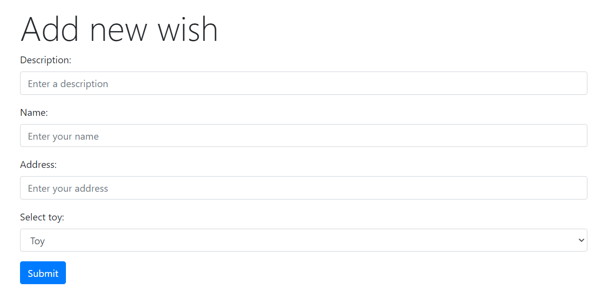

# Solution
I developed the WishListApp using three distinct Azure Functions. The *AddWish* function handles form input and writes wish data to the Cosmos database. The *CosmosDBTrigger* monitors new wishes added to the database. When a new wish is detected, the trigger sends a notification message to Slack, alerting the elves. Additionally, the *GetAllWishes* function retrieves all wishes currently stored in the database.
## The end point: [GET] /api/GetAllWishes
```json
[
  {
    "id": "deea383c-6be9-4e93-a8e3-141b65c2cbbe",
    "description": "A red ferrari f40.",
    "who": "Bart Simpson ",
    "address": "742 Evergreen Terrace",
    "type": "Other"
  },
  {
    "id": "41e36619-48ae-4618-ad63-5bf90d092a70",
    "description": "A cute little squirrel.",
    "who": "Lisa Simpson ",
    "address": "742 Evergreen Terrace",
    "type": "Animal"
  },
  {
    "id": "2d56aaf0-e0f7-46f5-8862-4db7d3bd3d58",
    "description": "A hat with built in air conditioner!",
    "who": "Lisa Simpson ",
    "address": "742 Evergreen Terrace",
    "type": "Other"
  }
]
```
###### _JSON Example of GetAllWishes response._
The wish data is stored in the Cosmos database. An example of the data format is shown below.
```json
{
    "id": "2d56aaf0-e0f7-46f5-8862-4db7d3bd3d58",
    "description": "A hat with built in air conditioner!",
    "who": "Lisa Simpson ",
    "address": "742 Evergreen Terrace",
    "type": "Other",
    "_rid": "ZT8fAJ37yr8NAAAAAAAAAA==",
    "_self": "dbs/ZT8fAA==/colls/ZT8fAJ37yr8=/docs/ZT8fAJ37yr8NAAAAAAAAAA==/",
    "_etag": "\"000076e6-0000-1500-0000-66ba2ba90000\"",
    "_attachments": "attachments/",
    "_ts": 1723476905
}
```
###### _JSON Example of Cosmos DB content._
The used local.settings.json has the following format:
```json
{
    "IsEncrypted": false,
  "Values": {
    "AzureWebJobsStorage": "UseDevelopmentStorage=true",
    "FUNCTIONS_WORKER_RUNTIME": "dotnet-isolated",
    "CosmosDB:EndpointUrl": "https://santa-clause-account.documents.azure.com:443/",
    "CosmosDB:PrimaryKey": "<< KEY >>",
    "CosmosDB:DatabaseName": "santa-db",
    "CosmosDB:Container:Name": "wishes",
    "CosmosDB:Container:PartitionKey": "/id",
    "CosmosDBConnectionString": "<< CONNECTIONSTRING >>",
    "Slack:EndpointUrl": "<< WEBHOOK >>"
  }
}
```
###### _JSON Example of used local.settings.json content._

The form used to send a wish to Santa Claus can be seen below.



The Slack notifications received by the elves are shown below.


The *CosmosDBTrigger* utilizes an additional lease container to track changes in the database, as shown below.


# Challenge 11: Database Trigger


## The Challenge

### Wishmaster 2000

*Wednesday, 11 December*
It's that time of the year when all children start wishing for something amazing to end up in their stocking!

After last week's challenge, Santa's servers are completely overwhelmed with requests from children!

To help him handle the load, your challenge today is to build him a system that takes in childrens' requests and stores them for later processing. Additionally, he wants his elves to be notified every time a new gift wish arrives. If each new wish was published to something like Slack or Microsoft Teams, that would be super helpful in keeping his elves on top of all the requests!

Santa needs an endpoint that receives data in this format:

a description of the wish
who it's from
address
type of present (e.g toy, clothes, animal etc..)
Santa should be able to query that database on his own (he's a bit of a micromanager — this helps keep him off the elves' back!), as well as having a message get posted to Slack or another chat service whenever data is added to the database.

As a bonus challenge: kids would love a nice UI to input their wishes. Help them by building a webpage with a form that submits data in the previous format!